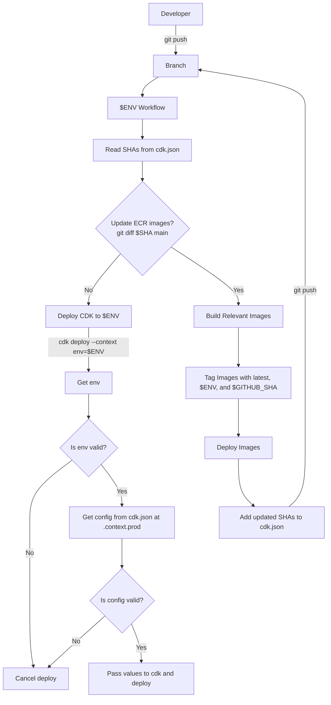

# Example Deployment Strategy to Replace AWS CodePipeline

## Motivation

CodePipeline has several disadvantages:

- Slow startup: It needs to build itself on every run, even twice when there are updates to the pipeline itself, since it is built via a programming language, like TypeScript
- Lack of image caching: Nested images that are built by the pipeline, such as those for Lambdas or EC2 instances, are not/cannot be cached and so must be rebuilt on every run
- Lack of portability: the only way to reuse a Pipeline across multiple repositories is to use a package manager, like NPM

GitHub Actions resolves many of these issues:

- Start up is almost immediate, with an often negligible amount of time to provision resources
- Images can be built and cached to ECR as a part of a workflow
- With an Enterprise account, GitHub Actions can be reused across an organization without the need for packaging

## Basic Infrastructure

The CDK itself simply deploys a stack with a number of Lambdas built from ECR images. The stack can be deployed to one of three environments: prod, alpha, or devel. The configuration for each of these different environments can be found in the [cdk.json](./cdk.json), which is consumed at the top level of the stack based on the value of \$CDK_ENV in `npm run cdk deploy -- --context env=$CDK_ENV`, and passed down to the rest of the stack.

For our example, we will use `main` as defined in [./.github/workflows/cdk-deploy-prod.yaml](./.github/workflows/cdk-deploy-prod.yaml)

